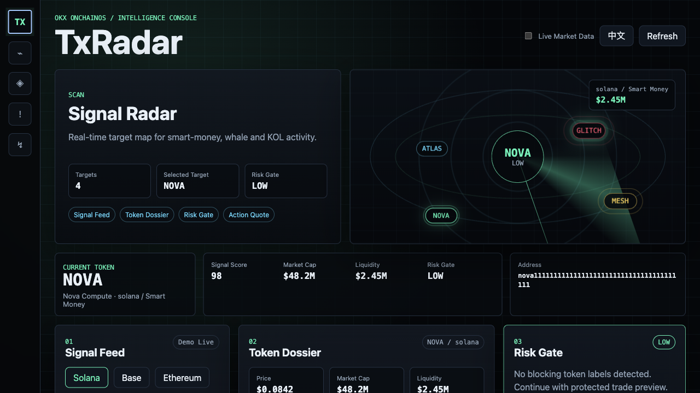
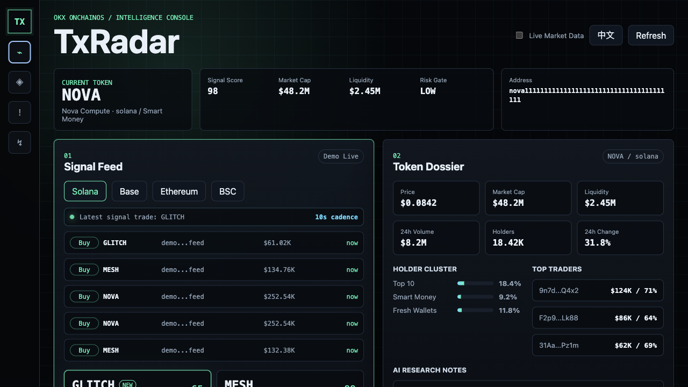
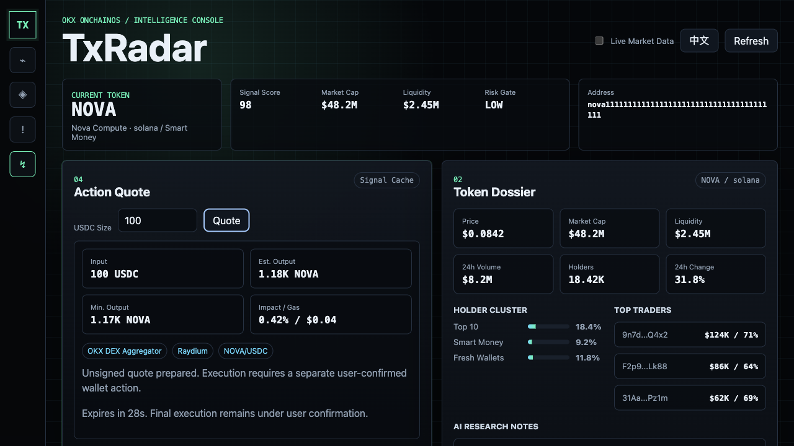

# TxRadar

**Participant ID:** `2054435044642000896`
**Submitted via:** `xagt-plugin@0.4.0`
**Submitted at:** 2026-05-13T08:09:46.832Z

## Description

TxRadar is a local OKX OnchainOS intelligence console for spotting high-signal token activity, checking risk, and preparing protected trade previews.

## Repo

https://github.com/wizardAEI/TxRadar

## Screenshots

## Deployed URL

https://wizardaei.github.io/TxRadar/

## Hackathon

Build with XAgent × OKX (May 2026)
